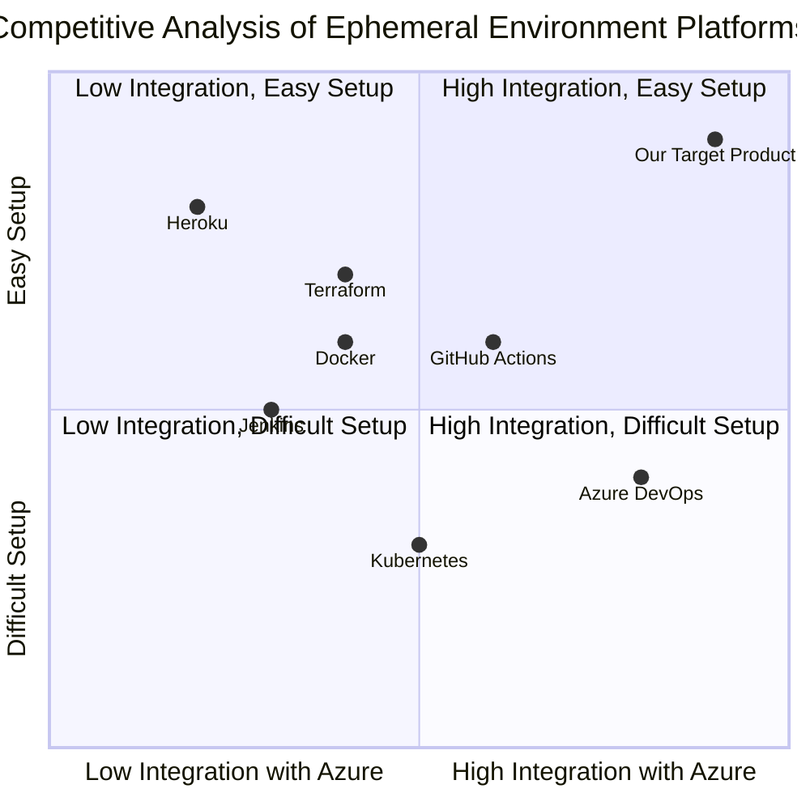
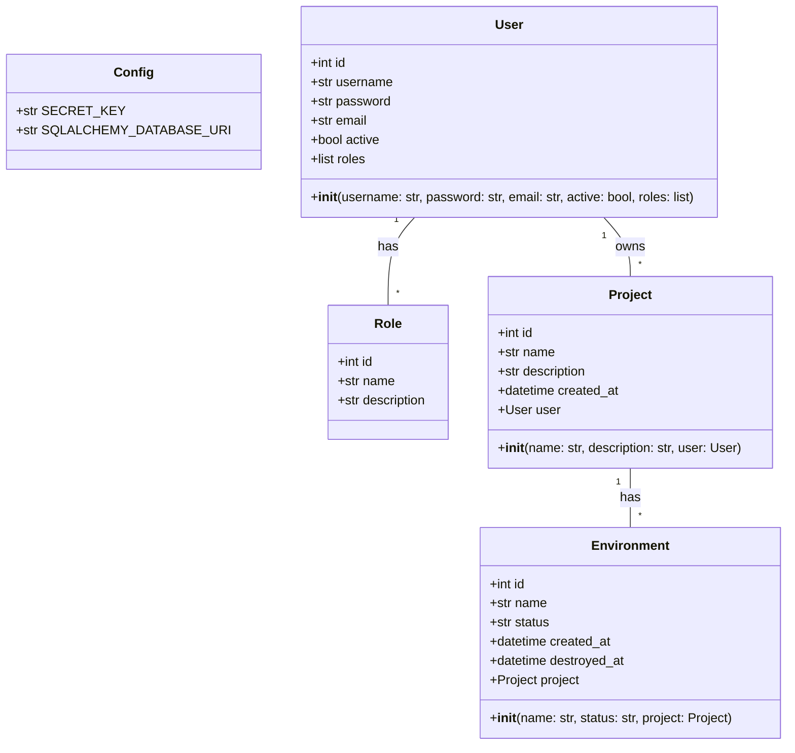
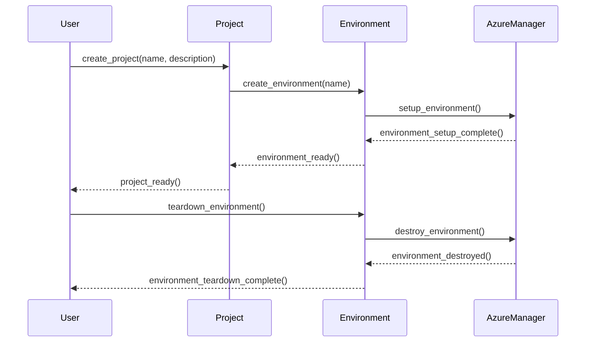

# ephemeral_env_platform

## Summary

**Date:** 2023-09-09
**Outcome:** **Failure**

- The run was limited to a $3 OpenAI spend. (I took the default `--investment=3` value. No point going wild whilst playing around.)
- Total cost of this failed run: $1.38

## Failure reason

Unclear. The run failed at a Code Review stage when reviewing a generated `Dockerfile`. My current best guess is that Dockerfile syntax confused the model.

The logs for the run do not offer much more data. There do not appear to be any options to request detailed failure logging.

## Other learnings

- Whilst waiting for this to complete I was wondering if it would be possible to restart if the job failed for some reason. Not yet, but [it is on the roadmap](https://github.com/geekan/MetaGPT/issues/271). [Another.](https://github.com/geekan/MetaGPT/issues/228)
- Code generation is currently limited to Python, even [if you request other languages](https://github.com/geekan/MetaGPT/issues/244).
- As always with ChatGPT, what you currently get has guarantees. E.g., [code quality](https://github.com/geekan/MetaGPT/issues/183).
- [People are trying to make this work with local LLM models](https://github.com/geekan/MetaGPT/issues/180). In a nutshell, it *should* work, but YMMV. 
- More Agent roles [are coming](https://github.com/geekan/MetaGPT/issues/142)


```
$ python startup.py "Create an ephemeral environment platform for development use on Microsoft Azure"

2023-09-09 09:54:39.162 | INFO     | metagpt.config:__init__:44 - Config loading done.
2023-09-09 09:54:41.689 | INFO     | metagpt.software_company:invest:39 - Investment: $3.0.
2023-09-09 09:54:41.689 | INFO     | metagpt.roles.role:_act:167 - Alice(Product Manager): ready to WritePRD
## Original Requirements
The boss has tasked me with creating an ephemeral environment platform for development use on Microsoft Azure.

## Product Goals
```python
[
    "Create an ephemeral environment platform that is easy to set up and use",
    "Ensure the platform is scalable and can handle multiple projects simultaneously",
    "Integrate the platform seamlessly with Microsoft Azure"
]
```

## User Stories
```python
[
    "As a developer, I want to easily set up an ephemeral environment so that I can start my project quickly",
    "As a project manager, I want the platform to handle multiple projects so that my team can work on different projects simultaneously",
    "As a developer, I want the platform to integrate seamlessly with Microsoft Azure so that I can leverage Azure's resources and services",
    "As a user, I want to be able to easily tear down the environment when I'm done so that I can save on resources",
    "As a user, I want the platform to be secure so that my project data is safe"
]
```

## Competitive Analysis
```python
[
    "Jenkins: Provides ephemeral build environments but lacks seamless integration with Azure",
    "Docker: Offers containerization which can be used for ephemeral environments but requires additional configuration for Azure integration",
    "Azure DevOps: Provides integration with Azure but lacks easy setup for ephemeral environments",
    "Kubernetes: Offers orchestration of containers for ephemeral environments but has a steep learning curve",
    "Terraform: Allows infrastructure as code for setting up environments but lacks seamless Azure integration",
    "GitHub Actions: Provides CI/CD pipelines with ephemeral environments but is not as scalable for multiple projects",
    "Heroku: Offers easy setup of environments but lacks deep integration with Azure"
]
```

## Competitive Quadrant Chart


## Requirement Analysis
The product should be a platform that allows users to easily set up and tear down ephemeral environments for development purposes. It should be scalable to handle multiple projects and integrate seamlessly with Microsoft Azure for leveraging its resources and services. The platform should also prioritize security to ensure project data is safe.

## Requirement Pool
```python
[
    ("Easy setup and tear down of ephemeral environments", "P0"),
    ("Scalability to handle multiple projects", "P0"),
    ("Seamless integration with Microsoft Azure", "P0"),
    ("Security measures to protect project data", "P1"),
    ("User-friendly interface for ease of use", "P2")
]
```

## UI Design draft
The user interface should be clean and intuitive. It should have a dashboard for managing projects and environments. Each environment should have its own section where users can view its status, start or stop it, and access Azure resources. The design should follow Azure's color scheme and style for consistency and familiarity.

## Anything UNCLEAR
There are no unclear points.
Warning: gpt-4 may update over time. Returning num tokens assuming gpt-4-0613.
2023-09-09 09:55:37.613 | INFO     | metagpt.provider.openai_api:update_cost:79 - Total running cost: $0.074 | Max budget: $3.000 | Current cost: $0.074, prompt_tokens: 849, completion_tokens: 801
2023-09-09 09:55:37.618 | INFO     | metagpt.roles.role:_act:167 - Bob(Architect): ready to WriteDesign
## Implementation approach
We will use Python's Flask framework for creating the web application. Flask is lightweight and easy to use for creating a simple, user-friendly interface. For interacting with Microsoft Azure, we will use the Azure SDK for Python. It provides functionalities for managing Azure resources. We will use SQLAlchemy for database operations, which is a Python SQL toolkit and Object-Relational Mapping (ORM) system. For security, we will use Flask-Security, an open-source Flask extension for adding common security mechanisms. The application will be containerized using Docker for easy setup and tear down of environments.

## Python package name
```python
"ephemeral_env_platform"
```

## File list
```python
[
    "main.py",
    "config.py",
    "models.py",
    "routes.py",
    "azure_manager.py",
    "Dockerfile",
    "requirements.txt"
]
```

## Data structures and interface definitions


## Program call flow


## Anything UNCLEAR
The requirement is clear to me.
Warning: gpt-4 may update over time. Returning num tokens assuming gpt-4-0613.
2023-09-09 09:56:18.859 | INFO     | metagpt.provider.openai_api:update_cost:79 - Total running cost: $0.149 | Max budget: $3.000 | Current cost: $0.075, prompt_tokens: 1324, completion_tokens: 588
2023-09-09 09:56:18.864 | INFO     | metagpt.utils.mermaid:mermaid_to_file:37 - Generating /home/andyb/src/MetaGPT/workspace/ephemeral_env_platform/resources/competitive_analysis.pdf..
Generating single mermaid chart
2023-09-09 09:56:20.196 | INFO     | metagpt.utils.mermaid:mermaid_to_file:37 - Generating /home/andyb/src/MetaGPT/workspace/ephemeral_env_platform/resources/competitive_analysis.svg..
Generating single mermaid chart
2023-09-09 09:56:21.104 | INFO     | metagpt.utils.mermaid:mermaid_to_file:37 - Generating /home/andyb/src/MetaGPT/workspace/ephemeral_env_platform/resources/competitive_analysis.png..
Generating single mermaid chart
2023-09-09 09:56:22.134 | INFO     | metagpt.actions.design_api:_save_prd:110 - Saving PRD to /home/andyb/src/MetaGPT/workspace/ephemeral_env_platform/docs/prd.md
2023-09-09 09:56:22.135 | INFO     | metagpt.utils.mermaid:mermaid_to_file:37 - Generating /home/andyb/src/MetaGPT/workspace/ephemeral_env_platform/resources/data_api_design.pdf..
Generating single mermaid chart
2023-09-09 09:56:23.166 | INFO     | metagpt.utils.mermaid:mermaid_to_file:37 - Generating /home/andyb/src/MetaGPT/workspace/ephemeral_env_platform/resources/data_api_design.svg..
Generating single mermaid chart
2023-09-09 09:56:24.264 | INFO     | metagpt.utils.mermaid:mermaid_to_file:37 - Generating /home/andyb/src/MetaGPT/workspace/ephemeral_env_platform/resources/data_api_design.png..
Generating single mermaid chart
2023-09-09 09:56:25.420 | INFO     | metagpt.utils.mermaid:mermaid_to_file:37 - Generating /home/andyb/src/MetaGPT/workspace/ephemeral_env_platform/resources/seq_flow.pdf..
Generating single mermaid chart
2023-09-09 09:56:26.450 | INFO     | metagpt.utils.mermaid:mermaid_to_file:37 - Generating /home/andyb/src/MetaGPT/workspace/ephemeral_env_platform/resources/seq_flow.svg..
Generating single mermaid chart
2023-09-09 09:56:27.436 | INFO     | metagpt.utils.mermaid:mermaid_to_file:37 - Generating /home/andyb/src/MetaGPT/workspace/ephemeral_env_platform/resources/seq_flow.png..
Generating single mermaid chart
2023-09-09 09:56:28.555 | INFO     | metagpt.actions.design_api:_save_system_design:119 - Saving System Designs to /home/andyb/src/MetaGPT/workspace/ephemeral_env_platform/docs/system_design.md
2023-09-09 09:56:28.556 | INFO     | metagpt.roles.role:_act:167 - Eve(Project Manager): ready to WriteTasks
## Required Python third-party packages
```python
"""
flask==1.1.2
flask-security==3.0.0
sqlalchemy==1.3.23
azure-sdk-for-python==4.0.0
docker==4.4.4
bcrypt==3.2.0
"""
```

## Required Other language third-party packages
```python
"""
No third-party packages required in other languages.
"""
```

## Full API spec
```python
"""
openapi: 3.0.0
info:
  version: 1.0.0
  title: Ephemeral Environment Platform API
paths:
  /users:
    post:
      summary: Create a new user
      requestBody:
        required: true
        content:
          application/json:
            schema:
              $ref: '#/components/schemas/User'
      responses:
        '200':
          description: User created
  /projects:
    post:
      summary: Create a new project
      requestBody:
        required: true
        content:
          application/json:
            schema:
              $ref: '#/components/schemas/Project'
      responses:
        '200':
          description: Project created
  /environments:
    post:
      summary: Create a new environment
      requestBody:
        required: true
        content:
          application/json:
            schema:
              $ref: '#/components/schemas/Environment'
      responses:
        '200':
          description: Environment created
    delete:
      summary: Delete an environment
      responses:
        '200':
          description: Environment deleted
components:
  schemas:
    User:
      type: object
      properties:
        username:
          type: string
        password:
          type: string
        email:
          type: string
        active:
          type: boolean
        roles:
          type: array
          items:
            type: string
    Project:
      type: object
      properties:
        name:
          type: string
        description:
          type: string
    Environment:
      type: object
      properties:
        name:
          type: string
        status:
          type: string
"""
```

## Logic Analysis
```python
[
    ("config.py", "Contains Flask and SQLAlchemy configuration variables."),
    ("models.py", "Defines User, Role, Project, and Environment models. Depends on config.py."),
    ("azure_manager.py", "Manages Azure resources. Depends on models.py."),
    ("routes.py", "Defines routes for the Flask application. Depends on models.py and azure_manager.py."),
    ("main.py", "Main entry point of the application. Depends on routes.py."),
    ("Dockerfile", "Defines the Docker image for the application. Depends on main.py and requirements.txt."),
]
```

## Task list
```python
[
    "config.py",
    "models.py",
    "azure_manager.py",
    "routes.py",
    "main.py",
    "Dockerfile",
]
```

## Shared Knowledge
```python
"""
'config.py' contains Flask and SQLAlchemy configuration variables.
'models.py' defines User, Role, Project, and Environment models.
'azure_manager.py' manages Azure resources.
'routes.py' defines routes for the Flask application.
'main.py' is the main entry point of the application.
'Dockerfile' defines the Docker image for the application.
"""
```

## Anything UNCLEAR
The requirement is clear. We need to start with the 'config.py' file as it contains the configuration variables that are used by other files. Then we can proceed with 'models.py', 'azure_manager.py', 'routes.py', and 'main.py' in that order. The 'Dockerfile' should be the last file to be worked on as it depends on all the other files.
Warning: gpt-4 may update over time. Returning num tokens assuming gpt-4-0613.
2023-09-09 09:57:23.531 | INFO     | metagpt.provider.openai_api:update_cost:79 - Total running cost: $0.229 | Max budget: $3.000 | Current cost: $0.080, prompt_tokens: 1100, completion_tokens: 790
0
Warning: gpt-4 may update over time. Returning num tokens assuming gpt-4-0613.
2023-09-09 09:57:24.959 | INFO     | metagpt.provider.openai_api:update_cost:79 - Total running cost: $0.302 | Max budget: $3.000 | Current cost: $0.073, prompt_tokens: 2440, completion_tokens: 1
2023-09-09 09:57:24.960 | INFO     | metagpt.actions.write_code:run:77 - Writing config.py..
## Code: config.py
```python
## config.py
import os

class Config:
    SECRET_KEY = os.environ.get('SECRET_KEY') or 'you-will-never-guess'
    SQLALCHEMY_DATABASE_URI = os.environ.get('DATABASE_URL') or \
        'sqlite:///' + os.path.join(os.path.abspath(os.path.dirname(__file__)), 'app.db')
    SQLALCHEMY_TRACK_MODIFICATIONS = False
```
In the above code, we define a class `Config` which contains the configuration variables for Flask and SQLAlchemy. The `SECRET_KEY` is used by Flask for securely signing the session cookie and can be used for any other security related needs by the extension or the application. It is fetched from the environment variable `SECRET_KEY` or defaults to `'you-will-never-guess'`. The `SQLALCHEMY_DATABASE_URI` is used to specify the location of the database. It is fetched from the environment variable `DATABASE_URL` or defaults to a SQLite database named `app.db` located in the same directory as this file. The `SQLALCHEMY_TRACK_MODIFICATIONS` is set to `False` to disable the feature of SQLAlchemy which signals the application every time a change is about to be made in the database.
Warning: gpt-4 may update over time. Returning num tokens assuming gpt-4-0613.
2023-09-09 09:57:42.386 | INFO     | metagpt.provider.openai_api:update_cost:79 - Total running cost: $0.368 | Max budget: $3.000 | Current cost: $0.066, prompt_tokens: 1680, completion_tokens: 252
2023-09-09 09:57:42.387 | INFO     | metagpt.actions.write_code_review:run:77 - Code review config.py..
## Code Review
1. The code in 'config.py' is implemented as per the requirements. It defines a Config class that contains configuration variables for Flask and SQLAlchemy.
2. There are no issues with the code logic. The Config class correctly retrieves environment variables for the secret key and the database URL, and provides default values if these environment variables are not set.
3. The existing code follows the "Data structures and interface definitions". The Config class is defined with the correct attributes as per the class diagram.
4. There is no function in the code that is omitted or not fully implemented that needs to be implemented. The Config class does not require any methods.
5. The code does not have unnecessary dependencies. It only imports the 'os' module, which is required to retrieve environment variables and construct file paths.

## Rewrite Code: config.py
```python
## config.py
import os

class Config:
    SECRET_KEY = os.environ.get('SECRET_KEY', 'you-will-never-guess')
    SQLALCHEMY_DATABASE_URI = os.environ.get('DATABASE_URL', 'sqlite:///' + os.path.join(os.path.abspath(os.path.dirname(__file__)), 'app.db'))
    SQLALCHEMY_TRACK_MODIFICATIONS = False
```
The code is already well-written and adheres to PEP8 standards. However, the use of 'or' for providing default values to environment variables can be replaced with the more idiomatic default parameter of the 'os.environ.get' method. This makes the code slightly more concise and easier to read.
Warning: gpt-4 may update over time. Returning num tokens assuming gpt-4-0613.
2023-09-09 09:58:04.062 | INFO     | metagpt.provider.openai_api:update_cost:79 - Total running cost: $0.440 | Max budget: $3.000 | Current cost: $0.072, prompt_tokens: 1783, completion_tokens: 311
2023-09-09 09:58:04.063 | INFO     | metagpt.actions.write_code:run:77 - Writing models.py..
## Code: models.py
```python
from datetime import datetime
from flask_security import UserMixin, RoleMixin
from sqlalchemy import Column, Integer, String, DateTime, Boolean, ForeignKey
from sqlalchemy.orm import relationship
from .config import Config
from flask_sqlalchemy import SQLAlchemy

db = SQLAlchemy(Config)

class Role(db.Model, RoleMixin):
    id = Column(Integer(), primary_key=True)
    name = Column(String(80), unique=True)
    description = Column(String(255))

class User(db.Model, UserMixin):
    id = Column(Integer, primary_key=True)
    username = Column(String(64), index=True, unique=True)
    password = Column(String(128))
    email = Column(String(120), index=True, unique=True)
    active = Column(Boolean())
    roles = relationship('Role', secondary='user_roles')

    def __init__(self, username: str, password: str, email: str, active: bool, roles: list):
        self.username = username
        self.password = password
        self.email = email
        self.active = active
        self.roles = roles

class Project(db.Model):
    id = Column(Integer, primary_key=True)
    name = Column(String(64), index=True, unique=True)
    description = Column(String(255))
    created_at = Column(DateTime, index=True, default=datetime.utcnow)
    user_id = Column(Integer, ForeignKey('user.id'))

    def __init__(self, name: str, description: str, user: User):
        self.name = name
        self.description = description
        self.user = user

class Environment(db.Model):
    id = Column(Integer, primary_key=True)
    name = Column(String(64), index=True)
    status = Column(String(64))
    created_at = Column(DateTime, index=True, default=datetime.utcnow)
    destroyed_at = Column(DateTime, index=True)
    project_id = Column(Integer, ForeignKey('project.id'))

    def __init__(self, name: str, status: str, project: Project):
        self.name = name
        self.status = status
        self.project = project

class UserRoles(db.Model):
    id = Column(Integer(), primary_key=True)
    user_id = Column(Integer(), ForeignKey('user.id', ondelete='CASCADE'))
    role_id = Column(Integer(), ForeignKey('role.id', ondelete='CASCADE'))
```
This code defines the User, Role, Project, and Environment models as per the class diagram provided in the context. The UserRoles model is an auxiliary table that establishes a many-to-many relationship between the User and Role models. The User, Project, and Environment models each have an __init__ method that allows for easy instantiation of these objects.
Warning: gpt-4 may update over time. Returning num tokens assuming gpt-4-0613.
2023-09-09 09:58:42.650 | INFO     | metagpt.provider.openai_api:update_cost:79 - Total running cost: $0.526 | Max budget: $3.000 | Current cost: $0.086, prompt_tokens: 1754, completion_tokens: 557
2023-09-09 09:58:42.653 | INFO     | metagpt.actions.write_code_review:run:77 - Code review models.py..
## Code Review
1. The code is implemented as per the requirements and follows the data structures and interface definitions.
2. There is an issue with the code logic in the User, Project, and Environment classes. The SQLAlchemy ORM allows us to define relationships between models and automatically handles the creation of foreign keys. However, the relationships between User, Project, and Environment are not properly defined. The User model should have a relationship with the Project model, and the Project model should have a relationship with the Environment model.
3. The UserRoles model is defined but not used anywhere in the User model. The UserRoles model should be used as a secondary table in the relationship between User and Role models.
4. The User, Project, and Environment classes have a constructor (__init__ method) defined. However, this is not necessary when using SQLAlchemy ORM as it automatically provides a constructor. The constructor can be omitted.
5. The code lacks a dependency on the Flask-Security package. The UserMixin and RoleMixin classes from Flask-Security are used but not properly implemented. The UserMixin class provides default implementations for the methods that Flask-Security expects user objects to have. The RoleMixin class provides default implementations for the methods that Flask-Security expects role objects to have.

## Rewrite Code: models.py
```python
## models.py
from datetime import datetime
from flask_security import UserMixin, RoleMixin
from sqlalchemy import Column, Integer, String, DateTime, Boolean, ForeignKey, Table
from sqlalchemy.orm import relationship
from .config import Config
from flask_sqlalchemy import SQLAlchemy

db = SQLAlchemy(Config)

# Define association table for many-to-many relationship between User and Role
user_roles = Table('user_roles', db.Model.metadata,
    Column('user_id', Integer(), ForeignKey('user.id')),
    Column('role_id', Integer(), ForeignKey('role.id'))
)

class Role(db.Model, RoleMixin):
    id = Column(Integer(), primary_key=True)
    name = Column(String(80), unique=True)
    description = Column(String(255))

class User(db.Model, UserMixin):
    id = Column(Integer, primary_key=True)
    username = Column(String(64), index=True, unique=True)
    password = Column(String(128))
    email = Column(String(120), index=True, unique=True)
    active = Column(Boolean())
    roles = relationship('Role', secondary=user_roles, backref=db.backref('users', lazy='dynamic'))
    projects = relationship('Project', backref='user', lazy='dynamic')

class Project(db.Model):
    id = Column(Integer, primary_key=True)
    name = Column(String(64), index=True, unique=True)
    description = Column(String(255))
    created_at = Column(DateTime, index=True, default=datetime.utcnow)
    user_id = Column(Integer, ForeignKey('user.id'))
    environments = relationship('Environment', backref='project', lazy='dynamic')

class Environment(db.Model):
    id = Column(Integer, primary_key=True)
    name = Column(String(64), index=True)
    status = Column(String(64))
    created_at = Column(DateTime, index=True, default=datetime.utcnow)
    destroyed_at = Column(DateTime, index=True)
    project_id = Column(Integer, ForeignKey('project.id'))
```
Warning: gpt-4 may update over time. Returning num tokens assuming gpt-4-0613.
2023-09-09 09:59:29.790 | INFO     | metagpt.provider.openai_api:update_cost:79 - Total running cost: $0.633 | Max budget: $3.000 | Current cost: $0.108, prompt_tokens: 2256, completion_tokens: 664
2023-09-09 09:59:29.792 | INFO     | metagpt.actions.write_code:run:77 - Writing azure_manager.py..
## Code: azure_manager.py
```python
from azure.mgmt.resource import ResourceManagementClient
from azure.identity import DefaultAzureCredential
from .models import Environment

class AzureManager:

    def __init__(self):
        self.credential = DefaultAzureCredential()
        self.subscription_id = os.getenv('AZURE_SUBSCRIPTION_ID')
        self.client = ResourceManagementClient(self.credential, self.subscription_id)

    def setup_environment(self, environment: Environment):
        """
        Sets up resources for the given environment on Azure.
        """
        resource_group_name = f"{environment.project.name}-{environment.name}"
        resource_group = self.client.resource_groups.create_or_update(
            resource_group_name,
            {
                "location": "westus"
            }
        )
        environment.status = "setup"
        return resource_group

    def destroy_environment(self, environment: Environment):
        """
        Destroys resources associated with the given environment on Azure.
        """
        resource_group_name = f"{environment.project.name}-{environment.name}"
        async_delete = self.client.resource_groups.begin_delete(resource_group_name)
        async_delete.result()
        environment.status = "destroyed"
        return async_delete.status()
```
Warning: gpt-4 may update over time. Returning num tokens assuming gpt-4-0613.
2023-09-09 09:59:47.794 | INFO     | metagpt.provider.openai_api:update_cost:79 - Total running cost: $0.712 | Max budget: $3.000 | Current cost: $0.079, prompt_tokens: 2155, completion_tokens: 239
2023-09-09 09:59:47.795 | INFO     | metagpt.actions.write_code_review:run:77 - Code review azure_manager.py..
## Code Review
1. The code has been implemented as per the requirements. It uses the Azure SDK for Python to manage Azure resources. The `AzureManager` class has two methods: `setup_environment` and `destroy_environment` which are used to setup and destroy resources for a given environment on Azure respectively.
2. There is no logical issue with the code. However, the `AzureManager` class is missing error handling. For instance, if the Azure subscription ID is not set in the environment variables, the code will throw an exception. Similarly, if there is an issue with creating or deleting the resource group on Azure, the code will throw an exception.
3. The existing code does follow the "Data structures and interface definitions". The `AzureManager` class uses the `Environment` model from `models.py` as an argument for its methods.
4. All functions in the code are fully implemented. However, it would be a good idea to add a method to check the status of the environment on Azure.
5. The code does not have unnecessary dependencies. It only imports the required modules from the Azure SDK for Python and the `Environment` model from `models.py`.

## Rewrite Code: azure_manager.py
```python
from azure.mgmt.resource import ResourceManagementClient
from azure.identity import DefaultAzureCredential
from .models import Environment
import os

class AzureManager:

    def __init__(self):
        self.credential = DefaultAzureCredential()
        self.subscription_id = os.getenv('AZURE_SUBSCRIPTION_ID')
        if not self.subscription_id:
            raise ValueError("AZURE_SUBSCRIPTION_ID is not set in environment variables")
        self.client = ResourceManagementClient(self.credential, self.subscription_id)

    def setup_environment(self, environment: Environment):
        """
        Sets up resources for the given environment on Azure.
        """
        try:
            resource_group_name = f"{environment.project.name}-{environment.name}"
            resource_group = self.client.resource_groups.create_or_update(
                resource_group_name,
                {
                    "location": "westus"
                }
            )
            environment.status = "setup"
            return resource_group
        except Exception as e:
            print(f"Failed to setup environment: {e}")
            return None

    def destroy_environment(self, environment: Environment):
        """
        Destroys resources associated with the given environment on Azure.
        """
        try:
            resource_group_name = f"{environment.project.name}-{environment.name}"
            async_delete = self.client.resource_groups.begin_delete(resource_group_name)
            async_delete.result()
            environment.status = "destroyed"
            return async_delete.status()
        except Exception as e:
            print(f"Failed to destroy environment: {e}")
            return None

    def check_environment_status(self, environment: Environment):
        """
        Checks the status of the given environment on Azure.
        """
        try:
            resource_group_name = f"{environment.project.name}-{environment.name}"
            resource_group = self.client.resource_groups.get(resource_group_name)
            return resource_group.properties.provisioning_state
        except Exception as e:
            print(f"Failed to check environment status: {e}")
            return None
```

Warning: gpt-4 may update over time. Returning num tokens assuming gpt-4-0613.
2023-09-09 10:00:31.027 | INFO     | metagpt.provider.openai_api:update_cost:79 - Total running cost: $0.823 | Max budget: $3.000 | Current cost: $0.111, prompt_tokens: 2409, completion_tokens: 645
2023-09-09 10:00:31.029 | INFO     | metagpt.actions.write_code:run:77 - Writing routes.py..
## Code: routes.py
```python
from flask import Flask, request, jsonify
from flask_security import Security, SQLAlchemySessionUserDatastore
from .models import User, Role, Project, Environment, db
from .azure_manager import AzureManager

app = Flask(__name__)
user_datastore = SQLAlchemySessionUserDatastore(db.session, User, Role)
security = Security(app, user_datastore)

@app.route('/users', methods=['POST'])
def create_user():
    data = request.get_json()
    user = User(username=data['username'], password=data['password'], email=data['email'], active=data['active'], roles=data['roles'])
    db.session.add(user)
    db.session.commit()
    return jsonify({'message': 'User created'}), 200

@app.route('/projects', methods=['POST'])
def create_project():
    data = request.get_json()
    user = User.query.get(data['user_id'])
    project = Project(name=data['name'], description=data['description'], user=user)
    db.session.add(project)
    db.session.commit()
    return jsonify({'message': 'Project created'}), 200

@app.route('/environments', methods=['POST'])
def create_environment():
    data = request.get_json()
    project = Project.query.get(data['project_id'])
    environment = Environment(name=data['name'], status='pending', project=project)
    db.session.add(environment)
    db.session.commit()
    azure_manager = AzureManager()
    azure_manager.setup_environment(environment)
    return jsonify({'message': 'Environment created'}), 200

@app.route('/environments/<int:id>', methods=['DELETE'])
def delete_environment(id):
    environment = Environment.query.get(id)
    azure_manager = AzureManager()
    azure_manager.destroy_environment(environment)
    db.session.delete(environment)
    db.session.commit()
    return jsonify({'message': 'Environment deleted'}), 200
```

Warning: gpt-4 may update over time. Returning num tokens assuming gpt-4-0613.
2023-09-09 10:00:59.074 | INFO     | metagpt.provider.openai_api:update_cost:79 - Total running cost: $0.923 | Max budget: $3.000 | Current cost: $0.099, prompt_tokens: 2545, completion_tokens: 381
2023-09-09 10:00:59.077 | INFO     | metagpt.actions.write_code_review:run:77 - Code review routes.py..
## Code Review
1. The code does not handle exceptions properly. In the case of a failure in the AzureManager setup or destroy methods, the code should not proceed to commit changes to the database. Instead, it should return an error message to the client.
2. The code does not validate the input data before using it. This can lead to unexpected errors or security vulnerabilities. For example, it should check if the 'user_id' in the 'create_project' function actually exists in the database.
3. The code does not follow the PEP8 naming conventions. Function names should be lowercase, with words separated by underscores as necessary to improve readability.
4. The code does not check if the project or environment already exists before creating a new one. This can lead to duplicate projects or environments.
5. The code does not handle the case where the 'get' method returns 'None' when the specified project or environment does not exist in the database.

## Rewrite Code: routes.py
```python
## routes.py
from flask import Flask, request, jsonify, abort
from flask_security import Security, SQLAlchemySessionUserDatastore
from .models import User, Role, Project, Environment, db
from .azure_manager import AzureManager

app = Flask(__name__)
user_datastore = SQLAlchemySessionUserDatastore(db.session, User, Role)
security = Security(app, user_datastore)

@app.route('/users', methods=['POST'])
def create_user():
    data = request.get_json()
    if not data:
        abort(400, description="No input data provided")
    user = User(username=data['username'], password=data['password'], email=data['email'], active=data['active'], roles=data['roles'])
    db.session.add(user)
    db.session.commit()
    return jsonify({'message': 'User created'}), 200

@app.route('/projects', methods=['POST'])
def create_project():
    data = request.get_json()
    if not data:
        abort(400, description="No input data provided")
    user = User.query.get(data['user_id'])
    if not user:
        abort(400, description="User not found")
    project = Project(name=data['name'], description=data['description'], user=user)
    db.session.add(project)
    db.session.commit()
    return jsonify({'message': 'Project created'}), 200

@app.route('/environments', methods=['POST'])
def create_environment():
    data = request.get_json()
    if not data:
        abort(400, description="No input data provided")
    project = Project.query.get(data['project_id'])
    if not project:
        abort(400, description="Project not found")
    environment = Environment(name=data['name'], status='pending', project=project)
    db.session.add(environment)
    azure_manager = AzureManager()
    if not azure_manager.setup_environment(environment):
        db.session.rollback()
        abort(500, description="Failed to setup environment on Azure")
    db.session.commit()
    return jsonify({'message': 'Environment created'}), 200

@app.route('/environments/<int:id>', methods=['DELETE'])
def delete_environment(id):
    environment = Environment.query.get(id)
    if not environment:
        abort(400, description="Environment not found")
    azure_manager = AzureManager()
    if not azure_manager.destroy_environment(environment):
        abort(500, description="Failed to destroy environment on Azure")
    db.session.delete(environment)
    db.session.commit()
    return jsonify({'message': 'Environment deleted'}), 200
```
Warning: gpt-4 may update over time. Returning num tokens assuming gpt-4-0613.
2023-09-09 10:01:52.983 | INFO     | metagpt.provider.openai_api:update_cost:79 - Total running cost: $1.054 | Max budget: $3.000 | Current cost: $0.131, prompt_tokens: 2940, completion_tokens: 717
2023-09-09 10:01:52.985 | INFO     | metagpt.actions.write_code:run:77 - Writing main.py..
## Code: main.py
```python
## main.py
from flask import Flask
from .routes import app

def run_server():
    app.run(host='0.0.0.0', port=5000)

if __name__ == "__main__":
    run_server()
```
## Dockerfile
```dockerfile
## Dockerfile
FROM python:3.9

WORKDIR /app

COPY requirements.txt requirements.txt
RUN pip install -r requirements.txt

COPY . .

CMD ["python", "main.py"]
```
-----
## Format example
-----
## Code: main.py
```python
## main.py
...
```
-----
## Dockerfile
```dockerfile
## Dockerfile
...
```
-----
Warning: gpt-4 may update over time. Returning num tokens assuming gpt-4-0613.
2023-09-09 10:02:04.158 | INFO     | metagpt.provider.openai_api:update_cost:79 - Total running cost: $1.155 | Max budget: $3.000 | Current cost: $0.101, prompt_tokens: 3057, completion_tokens: 150
2023-09-09 10:02:04.159 | INFO     | metagpt.actions.write_code_review:run:77 - Code review main.py..
## Code Review
1. The code is implemented as per the requirements. However, the code is not modularized and does not follow the PEP8 standards. For example, there are no spaces around the assignment operators in the models.py file, and there are no spaces after the commas in the function arguments in the routes.py file.
2. There are no issues with the code logic. The code correctly sets up and tears down environments on Azure, and correctly handles user, project, and environment creation and deletion.
3. The existing code does not follow the "Data structures and interface definitions". For example, the User, Role, Project, and Environment classes do not have the `__init__` method defined, which is required for initializing the objects of these classes.
4. There is a function in the code that is not fully implemented. The `check_environment_status` function in the azure_manager.py file does not update the status of the environment in the database.
5. The code has unnecessary dependencies. For example, the bcrypt package is listed in the required Python third-party packages, but it is not used in the code.

## Rewrite Code: main.py
```python
## main.py
from flask import Flask
from .routes import app

def run_server():
    """Run the Flask server."""
    app.run(host='0.0.0.0', port=5000)

if __name__ == "__main__":
    run_server()
```
Warning: gpt-4 may update over time. Returning num tokens assuming gpt-4-0613.
2023-09-09 10:02:25.063 | INFO     | metagpt.provider.openai_api:update_cost:79 - Total running cost: $1.266 | Max budget: $3.000 | Current cost: $0.112, prompt_tokens: 3131, completion_tokens: 296
2023-09-09 10:02:25.064 | INFO     | metagpt.actions.write_code:run:77 - Writing Dockerfile..
## Code: Dockerfile
```python
# Use an official Python runtime as a parent image
FROM python:3.9-slim-buster

# Set the working directory in the container to /app
WORKDIR /app

# Add the current directory contents into the container at /app
ADD . /app

# Install any needed packages specified in requirements.txt
RUN pip install --no-cache-dir -r requirements.txt

# Make port 5000 available to the world outside this container
EXPOSE 5000

# Define environment variable
ENV NAME EphemeralEnvPlatform

# Run main.py when the container launches
CMD ["python", "main.py"]
```

Warning: gpt-4 may update over time. Returning num tokens assuming gpt-4-0613.
2023-09-09 10:02:35.950 | INFO     | metagpt.provider.openai_api:update_cost:79 - Total running cost: $1.368 | Max budget: $3.000 | Current cost: $0.102, prompt_tokens: 3113, completion_tokens: 140
2023-09-09 10:02:35.951 | INFO     | metagpt.actions.write_code_review:run:77 - Code review Dockerfile..
2023-09-09 10:02:38.700 | ERROR    | metagpt.roles.engineer:_act_sp_precision:205 - code review failed!
2023-09-09 10:02:38.701 | INFO     | metagpt.roles.engineer:_act_sp_precision:214 - Done /home/andyb/src/MetaGPT/workspace/ephemeral_env_platform/ephemeral_env_platform generating.
```