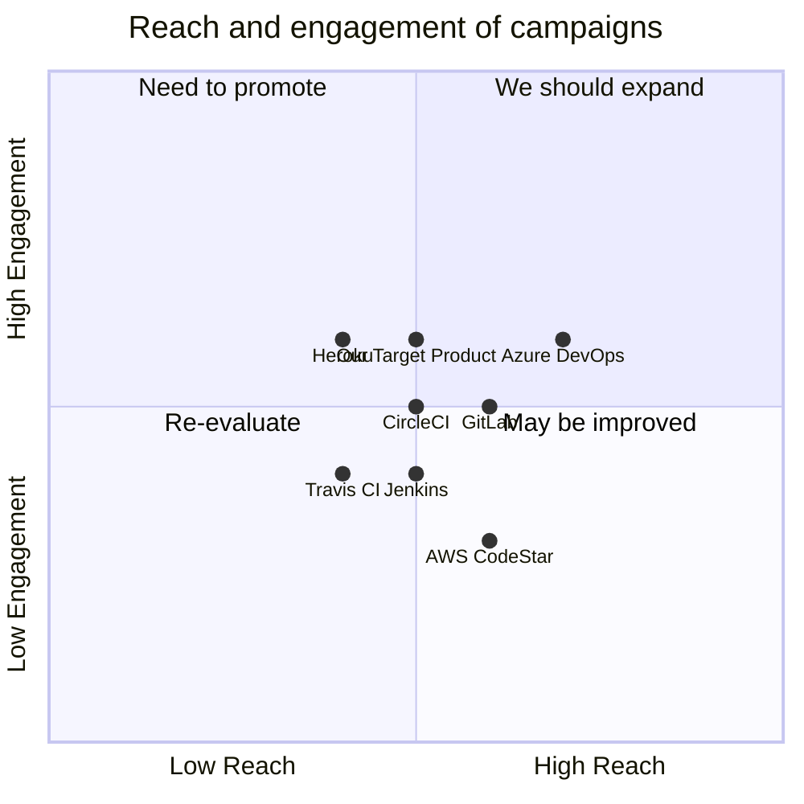

## Original Requirements
The boss has tasked us with creating an internal development platform for development use that supports ephemeral environments on Microsoft Azure.

## Product Goals
```python
[
    "Create an internal development platform that is easy to use and efficient",
    "Ensure the platform supports ephemeral environments",
    "Ensure the platform is compatible with Microsoft Azure"
]
```

## User Stories
```python
[
    "As a developer, I want to be able to quickly set up and tear down environments so that I can test my code in isolation",
    "As a developer, I want the platform to be compatible with Microsoft Azure so that I can leverage Azure's services",
    "As a project manager, I want to ensure that the platform is efficient and easy to use so that it doesn't slow down development",
    "As a system administrator, I want the platform to support ephemeral environments so that resources are not wasted",
    "As a CTO, I want the platform to be secure and reliable so that it doesn't pose a risk to the company's operations"
]
```

## Competitive Analysis
```python
[
    "Azure DevOps: Microsoft's own development platform. It is fully integrated with Azure but may lack some features for ephemeral environments",
    "Jenkins: A popular open-source development platform. It supports ephemeral environments but may require additional configuration for Azure",
    "GitLab: Offers a robust platform with ephemeral environments support. However, it is not specifically tailored for Azure",
    "Heroku: Known for its easy setup and support for ephemeral environments but it's not deeply integrated with Azure",
    "CircleCI: Offers a cloud-native continuous integration platform that supports ephemeral environments. Azure compatibility may require additional setup",
    "Travis CI: Another continuous integration platform that supports ephemeral environments. It is not specifically designed for Azure",
    "AWS CodeStar: AWS's development platform. It supports ephemeral environments but is not compatible with Azure"
]
```

## Competitive Quadrant Chart


## Requirement Analysis
The product should be an internal development platform that supports ephemeral environments and is compatible with Microsoft Azure. It should be easy to use, efficient, secure, and reliable.

## Requirement Pool
```python
[
    ("Support for ephemeral environments", "P0"),
    ("Compatibility with Microsoft Azure", "P0"),
    ("Ease of use", "P0"),
    ("Efficiency in resource usage", "P1"),
    ("Security and reliability", "P1")
]
```

## UI Design draft
The platform should have a clean, intuitive interface. It should have a dashboard for monitoring the status of environments, a section for managing environments, and a settings section for configuring Azure integration and other parameters. The layout should be simple and straightforward, with a navigation bar on the left and the main content area on the right.

## Anything UNCLEAR
There are no unclear points.