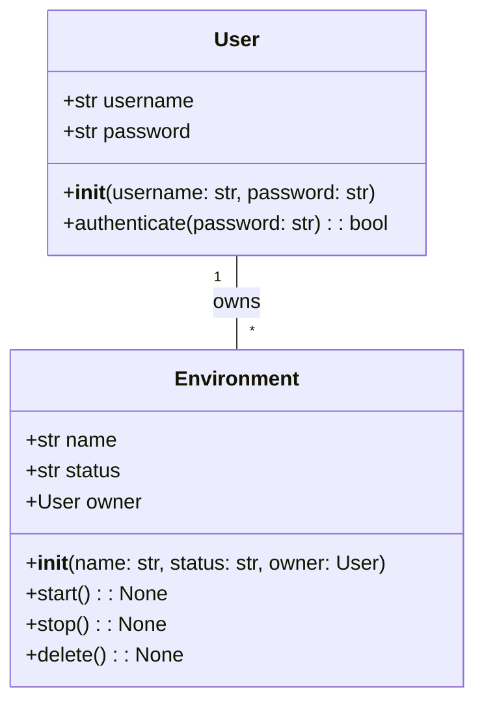
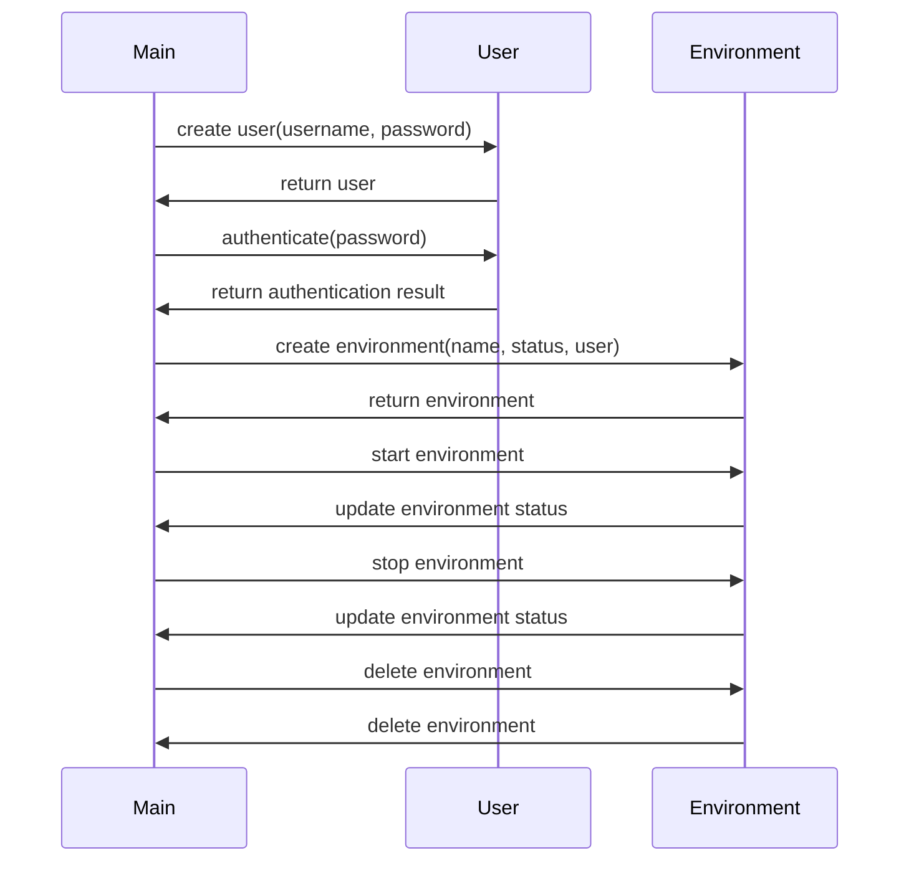

## Implementation approach
We will use Flask, an open-source Python web framework, for building our internal development platform. Flask is lightweight, easy to use, and has a large community for support. For ephemeral environments, we will use Docker, an open-source platform that allows us to create, deploy, and run applications by using containers. Docker containers are lightweight and ephemeral, which makes them ideal for our use case. For Azure compatibility, we will use the Azure SDK for Python, which allows us to interact with Azure services. For the front-end, we will use Bootstrap, an open-source CSS framework, to create a clean and intuitive interface. We will also use SQLAlchemy, an open-source SQL toolkit and ORM for Python, for database operations.

## Python package name
```python
"azure_dev_platform"
```

## File list
```python
[
    "main.py",
    "config.py",
    "models.py",
    "routes.py",
    "templates/index.html",
    "templates/dashboard.html",
    "templates/settings.html",
    "static/css/main.css",
    "Dockerfile"
]
```

## Data structures and interface definitions


## Program call flow


## Anything UNCLEAR
The requirement is clear to me.