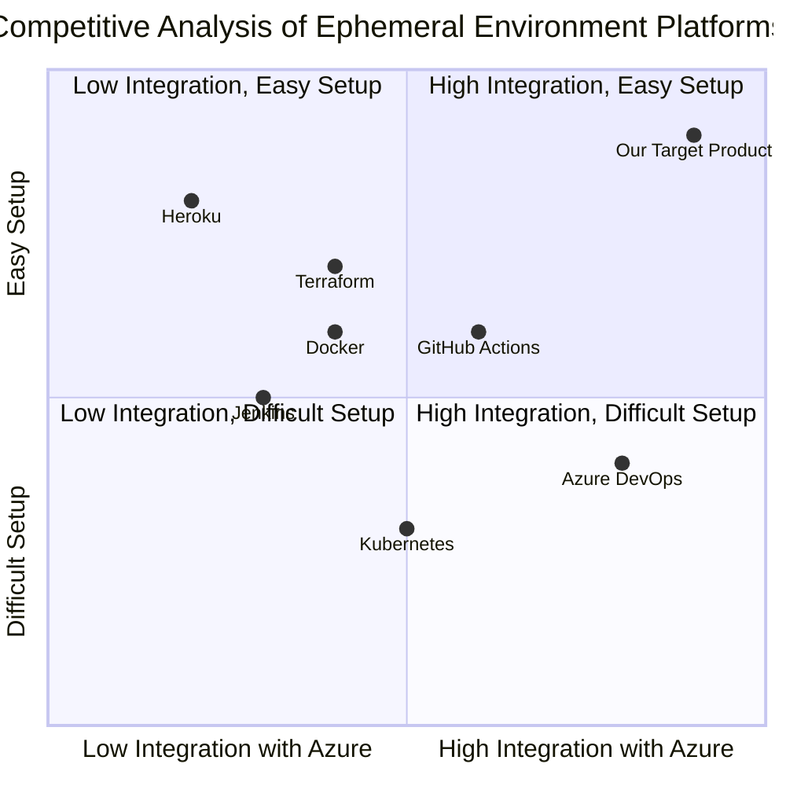

## Original Requirements
The boss has tasked me with creating an ephemeral environment platform for development use on Microsoft Azure.

## Product Goals
```python
[
    "Create an ephemeral environment platform that is easy to set up and use",
    "Ensure the platform is scalable and can handle multiple projects simultaneously",
    "Integrate the platform seamlessly with Microsoft Azure"
]
```

## User Stories
```python
[
    "As a developer, I want to easily set up an ephemeral environment so that I can start my project quickly",
    "As a project manager, I want the platform to handle multiple projects so that my team can work on different projects simultaneously",
    "As a developer, I want the platform to integrate seamlessly with Microsoft Azure so that I can leverage Azure's resources and services",
    "As a user, I want to be able to easily tear down the environment when I'm done so that I can save on resources",
    "As a user, I want the platform to be secure so that my project data is safe"
]
```

## Competitive Analysis
```python
[
    "Jenkins: Provides ephemeral build environments but lacks seamless integration with Azure",
    "Docker: Offers containerization which can be used for ephemeral environments but requires additional configuration for Azure integration",
    "Azure DevOps: Provides integration with Azure but lacks easy setup for ephemeral environments",
    "Kubernetes: Offers orchestration of containers for ephemeral environments but has a steep learning curve",
    "Terraform: Allows infrastructure as code for setting up environments but lacks seamless Azure integration",
    "GitHub Actions: Provides CI/CD pipelines with ephemeral environments but is not as scalable for multiple projects",
    "Heroku: Offers easy setup of environments but lacks deep integration with Azure"
]
```

## Competitive Quadrant Chart


## Requirement Analysis
The product should be a platform that allows users to easily set up and tear down ephemeral environments for development purposes. It should be scalable to handle multiple projects and integrate seamlessly with Microsoft Azure for leveraging its resources and services. The platform should also prioritize security to ensure project data is safe.

## Requirement Pool
```python
[
    ("Easy setup and tear down of ephemeral environments", "P0"),
    ("Scalability to handle multiple projects", "P0"),
    ("Seamless integration with Microsoft Azure", "P0"),
    ("Security measures to protect project data", "P1"),
    ("User-friendly interface for ease of use", "P2")
]
```

## UI Design draft
The user interface should be clean and intuitive. It should have a dashboard for managing projects and environments. Each environment should have its own section where users can view its status, start or stop it, and access Azure resources. The design should follow Azure's color scheme and style for consistency and familiarity.

## Anything UNCLEAR
There are no unclear points.