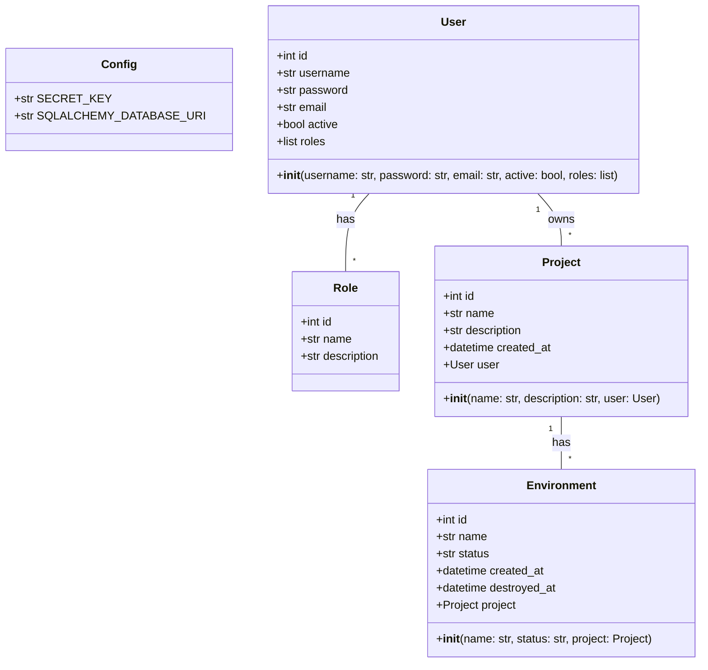
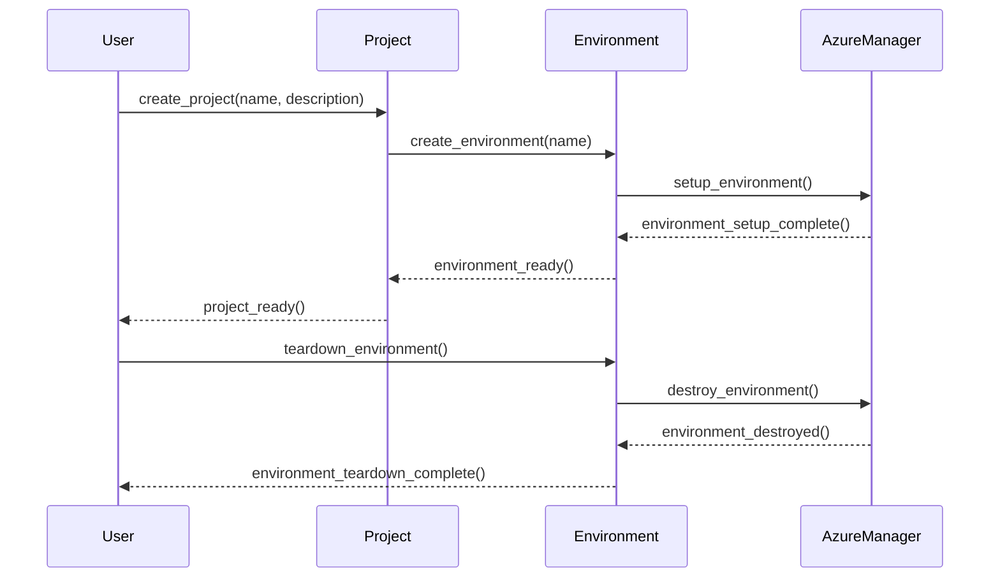

## Implementation approach
We will use Python's Flask framework for creating the web application. Flask is lightweight and easy to use for creating a simple, user-friendly interface. For interacting with Microsoft Azure, we will use the Azure SDK for Python. It provides functionalities for managing Azure resources. We will use SQLAlchemy for database operations, which is a Python SQL toolkit and Object-Relational Mapping (ORM) system. For security, we will use Flask-Security, an open-source Flask extension for adding common security mechanisms. The application will be containerized using Docker for easy setup and tear down of environments.

## Python package name
```python
"ephemeral_env_platform"
```

## File list
```python
[
    "main.py",
    "config.py",
    "models.py",
    "routes.py",
    "azure_manager.py",
    "Dockerfile",
    "requirements.txt"
]
```

## Data structures and interface definitions


## Program call flow


## Anything UNCLEAR
The requirement is clear to me.